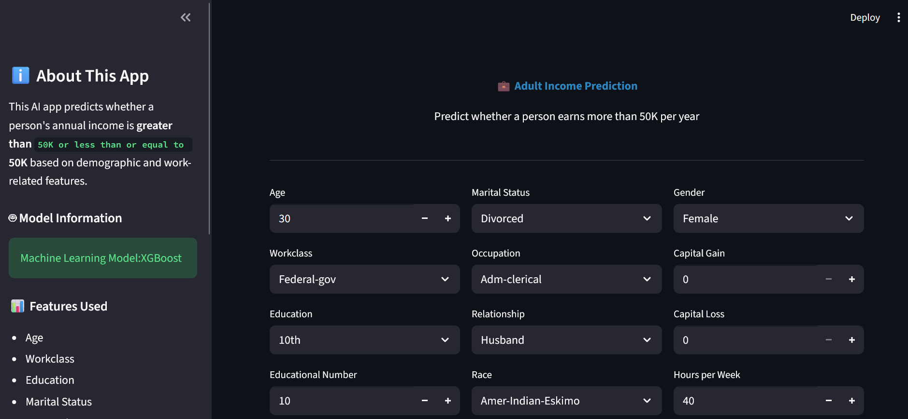
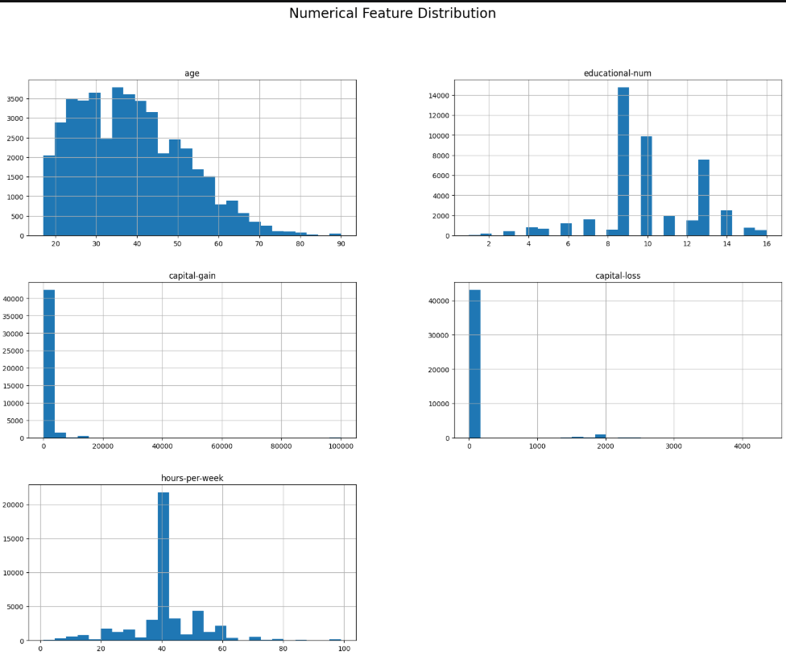

# Adult Income Prediction using Machine Learning

## Project Overview
This project predicts whether a person's annual income exceeds $50K based on demographic and employment-related attributes. 
The model is trained on the Adult Income dataset and demonstrates an end-to-end machine learning workflow including 
data preprocessing, exploratory data analysis, feature engineering, model training, and evaluation.

---

## Problem Statement
Many organizations use predictive analytics to understand income levels based on demographic and employment information. 
The objective of this project is to build a classification model that can predict whether a person's income is greater than $50K.

---
## Application Demo

## Dataset
Adult Income Dataset

Features include:
- Age
- Workclass
- Education
- Marital Status
- Occupation
- Hours per week
- Capital gain / loss
- Native country

Target variable:
- Income (>50K or <=50K)

---

## Technologies Used
- Python
- Pandas
- NumPy
- Scikit-learn
- Matplotlib
- Seaborn
- Streamlit

---

## Project Workflow
   Data Collection → Data Cleaning → EDA → Feature Engineering → Model Training → Evaluation → Deployment

1. Data Collection
2. Data Cleaning
3. Exploratory Data Analysis
4. Feature Engineering
5. Model Training
6. Model Evaluation
7. Model Deployment

---

## Machine Learning Models Used
- Logistic Regression
- Decision Tree
- Random Forest
- Gradient Boosting

---

## Model Evaluation
Performance was evaluated using:

- Accuracy
- Precision
- Recall
- F1-score

The best performing model achieved approximately **85–87% accuracy**.

---

## Key Insights

Education & Occupation were the strongest predictors of income — individuals with higher education in professional/managerial roles had significantly higher chances of earning >50K
Age showed a positive correlation with income up to ~45 years, after which it plateaued
Married individuals (especially Married-civ-spouse) were more likely to earn >50K compared to other marital statuses
Capital Gain was a strong signal — even small non-zero capital gain values were associated with >50K income

## Data Visualization

Exploratory Data Analysis was performed to understand the dataset. 
Visualizations helped identify patterns between demographic features and income levels.

